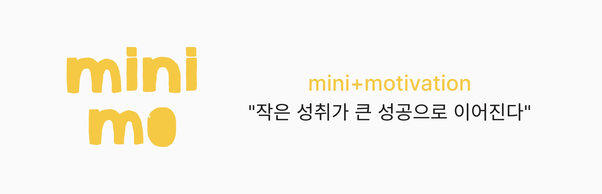

# Minimo



💛[Minimo 배포 서비스 링크](https://minimo-project.vercel.app/)💛

---

## 목차

- [소개](#-소개-introduction)
- [주요 기능](#-주요-기능-features)
- [기술 스택](#-기술-스택-tech-stack)
- [시작하기](#-시작하기-getting-started)
- [프로젝트 구조](#-프로젝트-구조-project-structure)
- [트러블 슈팅](#-트러블슈팅-troubleshooting)
- [구현 예정 기능](#-구현-예정-기능-future-enhancements)
- [팀원](#-팀원-team-members)

---

## 소개(Introduction)

**Minimo**는 사용자가 작은 챌린지를 만들고, 참여하며, 인증을 통해 성취감을 쌓을 수 있고, 작은 습관을 꾸준히 실천할 수 있도록 돕는 **참여형 SNS 플랫폼**입니다.

큰 목표는 멀게 느껴질 수 있지만, 작은 도전을 하나씩 해내면서 얻는 성취감은 우리를 더 큰 도전으로 이끌어줍니다. 사소한 성취라도 기록하고 자신감을 쌓을 수 있는 서비스를 만들고자, **미니 챌린지 SNS**를 기획하게 되었습니다.

#### 왜 Minimo인가요?

- 🎯 **간단한 시작**: 복잡한 설정 없이 바로 챌린지 시작
- 📊 **시각적 진행도**: 한눈에 보이는 성과 추적
- 🤝 **함께 성장**: 같은 목표를 가진 사람들과 동기부여

---

### 앱 화면 미리보기

- 챌린지 생성 페이지 (PC)
  

- 로그인 페이지 (PC)
  

|  |  |
| ------------------------------------------------------- | ---------------------------------------------------- |
| - 메인 페이지(Mobile)                                   | - 챌린지 상세 페이지(Mobile)                         |

---

## 주요 기능 (Features)

### 사용자 관리

- 🔐 소셜 로그인(구글, 카카오, 네이버)
- 👥 프로필 커스터마이징
- 📈 개인 통계 대시보드
- 🔒 공개/비공개 프로필 설정
- 🌓 라이트/다크 테마 테마 설정

### 챌린지

- ✍️ 챌린지 생성 및 참여
- 📸 챌린지 참여 인증(사진/텍스트)
- 🏷️ 카테고리별 챌린지 탐색
- 🔍 원하는 키워드로 챌린지 검색
- ⭐ 챌린지 찜하기

### 진행 상황 추적

- 📅 일별 인증 현황
- 📈 진행률 시각화
- 🎖️ 성공한 챌린지 기록

### 소셜 기능

- 💛 챌린지 인증 글 좋아요
- 👀 다른 사용자 챌린지 보기
- 🔗 챌린지 공유하기

---

## 🛠️ 기술 스택 (Tech Stack)

| 분류                   | 사용 기술                  |
| ---------------------- | -------------------------- |
| ⚙️ 프레임워크          | Next.js, React, PWA        |
| 💻 언어                | TypeScript                 |
| 🗄️ 데이터베이스 & Auth | Supabase                   |
| 🔄 상태 관리           | Zustand, SWR               |
| 🎨 UI & 스타일링       | Module CSS, Lucide, Swiper |
| 🖼️ 디자인              | Figma                      |
| 🚀 배포                | Vercel                     |
| 📦 패키지 매니저       | Bun                        |
| 💬 커뮤니케이션        | Discord                    |

---

## 설치 및 실행 (Getting Started)

### 사전 요구사항

- React 19, Next.js 15 버전 이상

### 1. 저장소 클론

```bash
git clone https://github.com/FRONTENDBOOTCAMP-14th/final-project-team-4.git
cd final-project-team-4
```

### 2. 의존성 설치

```bash
bun install
```

### 3. 환경 변수 설정

`.env.local` 파일을 생성하고 `.env.example` 파일을 참고하여 값을 채워주세요.

### 4. 실행

```bash
bun start
```

---

## 프로젝트 구조 (Project Structure)

```plaintext
minimo/
├─ public/                       # 정적 파일
│   └─ pwa-icon.png              # PWA 다운로드 용 아이콘
│
├─ src/
│   ├─ app/                      # App Router 라우팅 & 메타데이터
│   │   ├─ auth/                 # 로그인, 로그아웃, OAuth 콜백, 계정 삭제 관련 기능
│   │   ├─ challenges/           # [id], category/[category], create, search
│   │   ├─ user/                 # [userId]
│   │   ├─ wishlist/
│   │   │
│   │   ├─ layout.tsx            # 모든 페이지 공통 레이아웃
│   │   ├─ page.tsx              # "/" 메인 페이지 (홈)
│   │   │
│   │   ├─ icon.svg              # favicon 역할
│   │   └─ manifest.ts           # PWA manifest
│   │
│   ├─ components/               # UI 컴포넌트 모음
│   ├─ contexts/
│   ├─ lib/                      # 네이버 OAuth 관련 기능
│   ├─ styles/                   # 전역 스타일
│   ├─ types/                    # DB types
│   ├─ utils/
│   │   ├─ hooks/                # 커스텀 훅
│   │   └─ supabase/             # Supabase 관련 함수
│   │       └─ api/
│   └─ store/                    # Zustand 상태 관리 함수
│
├─ .gitignore                    # gitignore 설정
├─ .prettierrc                   # Prettier 설정
├─ bun.lock
├─ eslint.config.mjs             # ESLint 설정
├─ next-env.d.ts
├─ next.config.ts                # Next.js 설정
├─ package.json
├─ README.md
└─ tsconfig.json                 # TypeScript 설정

```

---

## 트러블슈팅 (Troubleshooting)

<details>

<summary>검색 상태 관리 구조 개선</summary>

**문제**: 검색어, 결과, 로딩/에러/정렬 등의 상태가 여러 컴포넌트에서 각각 관리되며 로직이 분산됨. 이로 인해 상태 일관성이 떨어지고, 컴포넌트 간 상태 공유 시 props drilling 등 복잡한 구조가 발생함.

**해결**: Zustand를 도입해 모든 검색 관련 상태를 하나의 전역 스토어에서 관리하도록 구조를 통합함. 이를 통해 상태 흐름을 한눈에 파악할 수 있고, 각 컴포넌트는 필요한 상태만 구독하여 코드 가독성과 유지보수성이 크게 향상됨. 또한 상태 초기화나 리셋 처리도 간단해져 개발 효율성이 증가함.

```tsx
export const useSearchStore = create<SearchState>((set) => ({
  query: "",
  searchResults: [],
  photoChallenges: [],
  writingChallenges: [],
  attendanceChallenges: [],
  photoSort: "latest",
  writingSort: "latest",
  attendanceSort: "latest",
  isLoading: false,
  isPhotoLoading: false,
  isWritingLoading: false,
  isAttendanceLoading: false,
  error: null,
  setQuery: (query) => set({ query }),
  setSearchResults: (results) => set({ searchResults: results }),
  setPhotoChallenges: (challenges) => set({ photoChallenges: challenges }),
  setWritingChallenges: (challenges) => set({ writingChallenges: challenges }),
  setAttendanceChallenges: (challenges) =>
    set({ attendanceChallenges: challenges }),
  setPhotoSort: (sort) => set({ photoSort: sort }),
  setWritingSort: (sort) => set({ writingSort: sort }),
  setAttendanceSort: (sort) => set({ attendanceSort: sort }),
  setLoading: (loading) => set({ isLoading: loading }),
  setPhotoLoading: (loading) => set({ isPhotoLoading: loading }),
  setWritingLoading: (loading) => set({ isWritingLoading: loading }),
  setAttendanceLoading: (loading) => set({ isAttendanceLoading: loading }),
  setError: (error) => set({ error }),
  resetSearch: () =>
    set({
      query: "",
      searchResults: [],
      photoChallenges: [],
      writingChallenges: [],
      attendanceChallenges: [],
      photoSort: "latest",
      writingSort: "latest",
      attendanceSort: "latest",
      isLoading: false,
      isPhotoLoading: false,
      isWritingLoading: false,
      isAttendanceLoading: false,
      error: null,
    }),
}))
```

</details>

<details>

<summary>유저 페이지 데이터 구조 개선</summary>

**문제**: 유저 페이지를 여러 섹션별 컴포넌트로 분리하면서 각 컴포넌트가 개별적으로 데이터를 요청.
이 과정에서 클라이언트 컴포넌트가 서버 전용 모듈을 import하는 문제가 발생해, “서버 전용 코드를 클라이언트에서 사용할 수 없음” 오류가 나타남.

**해결**: 데이터 요청을 하위 컴포넌트에서 분리해, 상위 wrapper 컴포넌트에서 한 번에 서버 데이터 페칭 후 각 섹션에 props로 전달하도록 구조를 변경함.
이를 통해 클라이언트/서버 경계를 명확히 하고, 데이터 흐름과 유지보수성을 개선.

```tsx
// Wrapper (Server Component)
export default async function UserChallengesSectionData() {
  const { data: ongoingParticipants } = await supabase
    .from("challenge_participants")
    .select("*")
    .eq("user_id", pageUser.id)
    .eq("is_progress", true)

  // ...더 많은 데이터 페칭
  RETURN(
    <UserChallengesSection
      isMyPage={isMyPage}
      ongoingChallenges={ongoingChallenges}
      pastChallenges={pastChallenges}
      createdChallenges={createdChallenges}
    />
  )
}

// Client Component
;("use client")

export default function UserChallengesSection({
  isMyPage,
  ongoingChallenges,
  pastChallenges,
  createdChallenges,
}) {
  // ...
}
```

</details>

<details>

<summary>Supabase with 네이버 소셜 로그인 구현</summary>

**문제**: Supabase에는 NAVER Provider가 존재하지 않아 OAuth 인증을 직접 구현해야 했다. NextAuth를 사용하면 프로젝트 아키텍처의 통일성이 깨지는 문제가 있었기 때문에 Supabase 기반으로 자체 인증 로직을 구성해야 했다.

**해결**: `getNaverTokenServerSide`, `getNaverUserInfoServerSide` 유틸 함수를 통해 코드 → 토큰 → 사용자 정보의 인증 흐름을 직접 구현하고, 콜백 라우트에서 Supabase 세션과 연동.
SSR 환경 대응을 위해 `cookies()` 객체 구조를 사용해 세션 타입 에러를 수정하고, `auth.users`에 유저 생성 시 `public.users`로 자동 복사되는 SQL 트리거 함수를 추가하여 네이버 소셜 로그인을 완성.

**getNaverUserInfoServerSide 함수**

```tsx
export const getNaverUserInfoServerSide = async (
  accessToken: string
): Promise<NaverUserResponse> => {
  const response = await fetch("https://openapi.naver.com/v1/nid/me", {
    headers: { Authorization: `Bearer ${accessToken}` },
    cache: "no-store",
  })

  const json = await response.json()

  if (!response.ok || json.resultcode !== "00") {
    throw new Error(
      `사용자 정보 가져오기에 실패했습니다. (HTTP ${response.status}) ${json.message ?? ""}`
    )
  }

  return json
}
```

</details>

<details>

<summary>폼 상태 관리 구조 개선</summary>

**문제**: 입력 필드를 컴포넌트 단위로 분리하면서, 각 필드의 값·에러·안내 문구를 루트 폼에서 일관성 있게 관리하기 어려운 구조가 되고 상태 변경 시 동기화가 복잡해지는 문제가 발생.

**해결**: 폼의 상태 관리는 루트 폼에서 수행하고, 각 인풋은 react-hook-form의 Controller로 감싸 루트 폼과 직접 연결.
이를 통해 인풋 단위의 실시간 피드백은 개별 인풋에서 빠르게 반영되게 하면서도, 상태 관리와 UI를 명확히 분리하고 일관된 props 규칙으로 구조적 안정성을 확보.

**create-form.tsx 일부 발췌**

```tsx
<div className={styles.scrollArea}>
        <Controller
          name="title"
          control={control}
          rules={{
            required: "챌린지 생성을 위한 타이틀을 입력해주세요.",
            maxLength: { value: 40, message: "40자 이내로 입력해주세요." },
          }}
          render={({ field, fieldState }) => (
            <TextInput
              id="title"
              value={field.value}
              onChange={field.onChange}
              error={fieldState.error?.message}
            />
          )}
        />

        <Controller
          name="category"
          control={control}
          render={({ field }) => (
            <ChoiceInput
              id="category"
              value={field.value}
              onChange={field.onChange}
            />
          )}
        />

        <Controller
          name="tags"
          control={control}
          render={({ field }) => (
            <TagInput id="tags" value={field.value} onChange={field.onChange} />
          )}
        />
```

</details>

---

## 구현 예정 기능 (Future Enhancements)

- 챌린지 인증 기록에 대한 댓글
- 유저 챌린지 뱃지 시스템
- 텍스트 온리 & 출석체크 인증 타입
- 부적절한 콘텐츠 및 유저 신고하기 기능

---

## 팀원 (Team Members)

- **박민성** – [GitHub](https://github.com/PMS990126)
- **차지현** – [GitHub](https://github.com/chajiiiii)
- **이지수** – [GitHub](https://github.com/chacokyo)
- **정우진** – [GitHub](https://github.com/wjinss)

---

**[맨 위로 가기](#minimo)**
